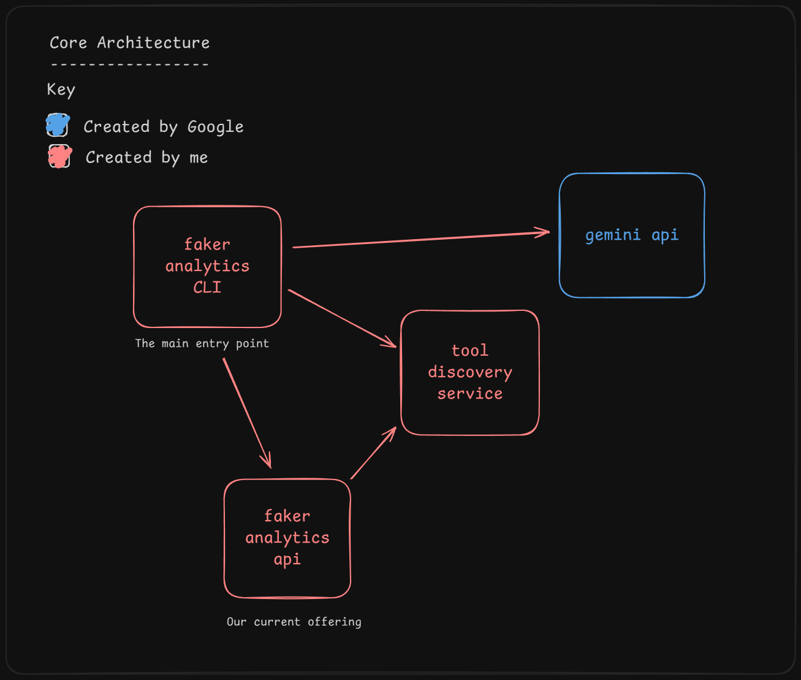

# First Steps

Bootstrapping the core services has taken longer than I had hoped.  Perhaps because I deliberately 
chose not to use coding agents.  I wanted to hand-craft these services to ensure I understood all the working
parts.  I am hoping that decision will pay off later when I am forced to consider various trade-offs.

Talking of trade-offs I have encountered my first.  It will make more sense if I cover core design 
first:



**`faker-analytics-api`**

This is our sample "traditional app".  It is a web API.  It was designed for programmatic access.
As such getting started can be difficult.  You need to read a few docs and write many lines of 
code before you can get any value out of it.  I'd like to see if gen AI can lower that initial 
barrier.

It is not important now.  But it exposes 2 endpoints:

- GET /api/trades
- GET /api/trades/ohlcv

**`faker-analytics-cli`**

My first experiment is focused on adding a natural language interface to the system.  I've decided 
to write a CLI.  Because who has the time to CSS?

**`tool-discovery-service`**

Ok.  I can guess what you are thinking.  _Why have you create a discovery service_?  _What kind of ivory tower is this_?
These are fair points.  For a silly little project like this there is no need for a discovery service.
But there a few things I would like to consider in more detail, including:

- How do you manage multiple tools, written in multiple languages?
- How are gen AI response times impacted as the number of tools increases?
- Can we dynamically add new functionality to existing apps?

That last one is really interesting.  Add new capabilities to existing apps normally requires: 100 x 
cups of coffee, 10 x commits, 3 x pipelines and 1 x deployment to prod.  The ability to add new tools
to existing workflows - at runtime - offers something very powerful.  For this reason I've added the
extra complication of a discovery service.  Which brings me back to my first trade-off (yay I'm back
on point).

It would be nice if our tools had the following properties:

1. Loose coupling with the tools that consume them
2. Can be written in any language
3. Dynamic

Wouldn't it be nice if we could always use the best tool for the job?  Strongly typed languages
complicate this.  Because:

- ✅ Type systems are great; they catch errors at compile time
- ❌ Loading new types _generally_ requires a fresh build
- ❌ New tools need new code paths

Avoiding these negatives lead me to something like this:

```cs
public class Tool
{
    public required string Name { get; init; }

    // What does the tool do?
    // What parameters does it support?
    // What does it return?
    public required ToolDefinition ToolDefinition { get; init; }

    // Where to find the tool.
    // i.e. GET /api/example?foo=bar
    public required ToolRoute ToolRoute { get; init; }

    // Execute the tool.
    public async Task<JsonObject> ExecuteAsync(JsonObject jsonParameters)
    {
        /* magic smoke here */
    }
}
```

I am not happy with the use of `JsonObject`.  Of course I could do this:

```cs
public class Tool<InType, OutType>
{
    /* snip */

    public async Task<OutType> ExecuteAsync(InType jsonParameters)
    {
        /* magic smoke here */
    }
}

```

But now every tool I create will need to publish its types.  Which has downsides:

- My consumer apps will need to import types for every tool it uses
- Where they will probably contain a switch statement with _n_ arms (where _n_ is the number of tools)
- Where users will need a fresh build to gain the benefit
- If I write a tool in a dynamic language I will need to write a strongly typed wrapper

I don't really like `Tool<InType, OutType>` or `Task<JsonObject> ExecuteAsync(JsonObject jsonParameters)`.  
Both have their issues.  But - for now at least - I have chosen to give up type safety in favour of
freedom and flexibility.  Why?  Because gen AI apps are different.  In theory they should be able to
seamlessly integrate a new tool in the next request they receive.  It is very hard of purely imperative
apps to pull this trick off.  In most cases you would need to write more code to support some new 
tool.  And if that was the case I would probably go the generics route.

So my first trade-off has been considered and made.

Let's see how this pans out.

Do you have a better approach?  Reach out, I'd love to hear your thoughts.

---

[Last](./2025-09-23.md)
[Next](./2025-09-25.md)
